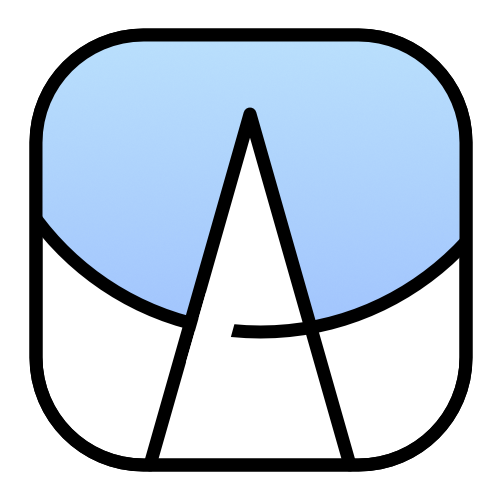

# My works

## Application

<table style="text-align: left">
<thead>
    <tr>
        <th>Icon</th>
        <th>Name</th>
        <th>Components</th>
        <th>Framework</th>
        <th>Platform</th>
        <th>Detail</th>
    </tr>
</thead>
<tbody>
    <tr>
        <td rowspan="2"></td>
        <td rowspan="2"><a href="https://github.com/Zhoucheng133/netPlayer-Next">netPlayer</a></td>
        <td><a href="https://github.com/Zhoucheng133/netPlayer-Next">App</a></td>
        <td rowspan="2">Flutter</td>
        <td rowspan="2"></td>
        <td rowspan="3">Subsonic & Navidrome based desktop music player</td>
    </tr>
    <tr>
        <td><del><a href="https://github.com/Zhoucheng133/netPlayer-mini-kit">Lyric Kit</a></del></td>
    </tr>
    <tr>
        <td></td>
        <td><a href="https://github.com/Zhoucheng133/netPlayer-Mobile">netPlayer Mobile</a></td>
        <td>/</td>
        <td>Flutter</td>
        <td></td>
    </tr>
    <tr>
        <td rowspan="3"></td>
        <td rowspan="3"><a href="https://github.com/Zhoucheng133/Sharer-App">Sharer</a></td>
        <td><a href="https://github.com/Zhoucheng133/Sharer-App">App</a></td>
        <td>Flutter</td>
        <td rowspan="3"></td>
        <td rowspan="3">File sharing tool</td>
    </tr>
    <tr>
        <td><a href="https://github.com/Zhoucheng133/Sharer-Core">Core</a></td>
        <td>Gin</td>
    </tr>
    <tr>
        <td><a href="https://github.com/Zhoucheng133/Sharer-Web">WebUI</a></td>
        <td>Vue</td>
    </tr>
    <tr>
        <td rowspan="2"></td>
        <td rowspan="2"><a href="https://github.com/Zhoucheng133/DAV-Server">DAV Server</a></td>
        <td><a href="https://github.com/Zhoucheng133/DAV-Server">App</a></td>
        <td>Flutter</td>
        <td rowspan="2"></td>
        <td rowspan="2">WebDAV Server</td>
    </tr>
    <tr>
        <td><a href="https://github.com/Zhoucheng133/DAV-Core">Core</a></td>
        <td>Gin</td>
    </tr>
    <tr>
        <td></td>
        <td><a href="https://github.com/Zhoucheng133/BitFlow">BitFlow</a></td>
        <td>/</td>
        <td>Flutter</td>
        <td>
        
        </td>
        <td >qBittorrent & Aria Cilent</td>
    </tr>
    <tr>
        <td rowspan="2"></td>
        <td rowspan="2"><a href="https://github.com/Zhoucheng133/Server-Express">Server Express</a></td>
        <td><a href="https://github.com/Zhoucheng133/Server-Express">App</a></td>
        <td>Flutter</td>
        <td rowspan="2"></td>
        <td rowspan="2">SFTP Client</td>
    </tr>
    <tr>
        <td><a href="https://github.com/Zhoucheng133/Server-Express-Core">Core</a></td>
        <td>Rust</td>
    </tr>
    <tr>
        <td rowspan="2"></td>
        <td rowspan="2"><a href="https://github.com/Zhoucheng133/Gamma-Setter">Gamma Setter</a></td>
        <td><a href="https://github.com/Zhoucheng133/Gamma-Setter">App</a></td>
        <td>Flutter</td>
        <td rowspan="2"></td>
        <td rowspan="2">Adjust monitor's gamma tool</td>
    </tr>
    <tr>
        <td><a href="https://github.com/Zhoucheng133/Gamma-Setter-Core">Core</a></td>
        <td>Rust</td>
    </tr>
    <tr>
        <td></td>
        <td><a href="https://github.com/Zhoucheng133/One-Loop">One Loop</a></td>
        <td>/</td>
        <td>Flutter</td>
        <td></td>
        <td >Loop an audio for mobile</td>
    </tr>
    <tr>
        <td></td>
        <td><a href="https://github.com/Zhoucheng133/Whisper-GUI">Whisper GUI</a></td>
        <td>/</td>
        <td>Flutter</td>
        <td></td>
        <td >Whisper GUI helper</td>
    </tr>
    <tr>
        <td rowspan="2"></td>
        <td rowspan="2"><a href="https://github.com/Zhoucheng133/Photo-Archiver">PhotoArchiver</a></td>
        <td><a href="https://github.com/Zhoucheng133/Photo-Archiver">App</a></td>
        <td>Flutter</td>
        <td rowspan="2"></td>
        <td rowspan="2">Make photos grouped by datetime</td>
    </tr>
    <tr>
        <td><a href="https://github.com/Zhoucheng133/PhotoArchiver-Core">Core</a></td>
        <td>Go</td>
    </tr>
    <tr>
        <td rowspan="2"></td>
        <td rowspan="2"><a href="https://github.com/Zhoucheng133/GitPack">GitPack</a></td>
        <td><a href="https://github.com/Zhoucheng133/GitPack">App</a></td>
        <td>Flutter</td>
        <td rowspan="2"></td>
        <td rowspan="2">Pack git repo without ignores</td>
    </tr>
    <tr>
        <td><a href="https://github.com/Zhoucheng133/GitPack-Core">Core</a></td>
        <td>Go</td>
    </tr>
    <tr>
        <td rowspan="2"></td>
        <td rowspan="2"><a href="https://github.com/Zhoucheng133/EXIF-Helper">EXIF Helper</a></td>
        <td><a href="https://github.com/Zhoucheng133/EXIF-Helper">App</a></td>
        <td>Flutter</td>
        <td rowspan="2"></td>
        <td rowspan="2">EXIF ​​watermark adding tool</td>
    </tr>
    <tr>
        <td><a href="https://github.com/Zhoucheng133/EXIF-Helper-Core">Core</a></td>
        <td>Go</td>
    </tr>
    <tr>
        <td rowspan="2"></td>
        <td rowspan="2"><a href="https://github.com/Zhoucheng133/HEIC-Converter">HEIC Converter</a></td>
        <td><a href="https://github.com/Zhoucheng133/HEIC-Converter">App</a></td>
        <td>Tauri</td>
        <td rowspan="2"></td>
        <td rowspan="2">HEIC & HEIF convert tool</td>
    </tr>
    <tr>
        <td><a href="https://github.com/Zhoucheng133/HEIC-Converter-Core">Core</a></td>
        <td>Python</td>
    </tr>
    <tr>
        <td></td>
        <td><a href="https://github.com/Zhoucheng133/Subs">Subs</a></td>
        <td>/</td>
        <td>Flutter</td>
        <td ></td>
        <td>Multi subtitles burning tool</td>
    </tr>
    <tr>
        <td></td>
        <td><a href="https://github.com/Zhoucheng133/pyftp-GUI">pyftp GUI</a></td>
        <td>/</td>
        <td>Flutter</td>
        <td></td>
        <td>pyftpdlib GUI helper</td>
    </tr>
    <tr>
        <td></td>
        <td><a href="https://github.com/Zhoucheng133/FFmpegGUI">FFmpeg GUI</a></td>
        <td>/</td>
        <td>Flutter</td>
        <td></td>
        <td>FFmpeg GUI helper</td>
    </tr>
    <tr>
        <td></td>
        <td><a href="https://github.com/Zhoucheng133/EasyChat">EasyChat</a></td>
        <td>/</td>
        <td>Flutter</td>
        <td></td>
        <td>OpenAPI Client</td>
    </tr>
    <tr>
        <td rowspan="2"></td>
        <td rowspan="2"><del><a href="https://github.com/Zhoucheng133/virtual-directory">Virtual Directory</a></del></td>
        <td><del><a href="https://github.com/Zhoucheng133/virtual-directory">App</a></del></td>
        <td>Electron</td>
        <td rowspan="2"></td>
        <td rowspan="2">[Split to Sharer and DAV Server]</td>
    </tr>
    <tr>
        <td><del><a href="https://github.com/Zhoucheng133/virtual-dir-page">WebUI</a></del></td>
        <td>Vue</td>
    </tr>
    <tr>
        <td rowspan=2></td>
        <td><del><a href="https://github.com/Zhoucheng133/AriaUI">Aria UI</a></del></td>
        <td rowspan=2>/</td>
        <td rowspan=2>Flutter</td>
        <td rowspan=2></td>
        <td rowspan=2>[Merge to BitFlow]</td>
    </tr>
    <tr>
        <td><del><a href="https://github.com/Zhoucheng133/Aria-Remote">Aria Remote</a></del></td>
    </tr>
    <tr>
        <td></td>
        <td> <a href="https://github.com/Zhoucheng133/Anime-Update-Panel"><del>Anime Update Panel</del></a></td>
        <td>/</td>
        <td>Flutter</td>
        <td></td>
        <td>[Merge to Anime Helper]</td>
    </tr>
</tbody>
</table>

## Service

<table style="text-align: left">
<thead>
    <tr>
        <th>Icon</th>
        <th>Name</th>
        <th>Components</th>
        <th>Framework</th>
        <th>Detail</th>
    </tr>
</thead>
<tbody>
    <tr>
        <td rowspan="2"></td>
        <td rowspan="2"><a href="https://github.com/Zhoucheng133/Anime-Helper">Anime Helper</a></td>
        <td><a href="https://github.com/Zhoucheng133/Anime-Helper">Server</a></td>
        <td>ElysiaJS</td>
        <td rowspan="2">Animation follow & download tool</td>
    </tr>
    <tr>
        <td><a href="https://github.com/Zhoucheng133/Anime-Helper-UI">WebUI</a></td>
        <td>Vue</td>
    </tr>
    <tr>
        <td rowspan="2"></td>
        <td rowspan="2"><a href="https://github.com/Zhoucheng133/Jackett-Helper">Jackett Helper</a></td>
        <td><a href="https://github.com/Zhoucheng133/Jackett-Helper">Server</a></td>
        <td>ElysiaJS</td>
        <td rowspan="2">Add task to aria from Jackett</td>
    </tr>
    <tr>
        <td><a href="https://github.com/Zhoucheng133/Jackett-Helper-Web">WebUI</a></td>
        <td>Vue</td>
    </tr>
    <tr>
        <td rowspan="2">/</td>
        <td rowspan="2"><a href="https://github.com/Zhoucheng133/Index-Page">Index Page</a></td>
        <td><a href="https://github.com/Zhoucheng133/Index-Page-Core">Server</a></td>
        <td>Gin</td>
        <td rowspan="2">Server Index page</td>
    </tr>
    <tr>
        <td><a href="https://github.com/Zhoucheng133/Index-Page">WebUI</a></td>
        <td>Vue</td>
    </tr>
    <tr>
        <td rowspan="2">/</td>
        <td rowspan="2"><a href="https://github.com/Zhoucheng133/SHT-API">SHT API</a></td>
        <td><a href="https://github.com/Zhoucheng133/SHT-API">Server</a></td>
        <td>FastAPI</td>
        <td rowspan="2">SHT sensor monitor</td>
    </tr>
    <tr>
        <td><a href="https://github.com/Zhoucheng133/SHT-Data-Statistics">WebUI</a></td>
        <td>Vue</td>
    </tr>
    <tr>
        <td rowspan="2">/</td>
        <td rowspan="2"><a href="https://github.com/Zhoucheng133/Monitor">Monitor</a></td>
        <td><a href="https://github.com/Zhoucheng133/Monitor">Server</a></td>
        <td>Spring (Kotlin)</td>
        <td rowspan="2">System monitor page</td>
    </tr>
    <tr>
        <td><a href="https://github.com/Zhoucheng133/Monitor-UI">WebUI</a></td>
        <td>Vue</td>
    </tr>
    <tr>
        <td rowspan="2">/</td>
        <td rowspan="2"><del><a href="https://github.com/Zhoucheng133/Mikan-Helper">Mikan Helper</a></del></td>
        <td><del><a href="https://github.com/Zhoucheng133/Mikan-Helper">Server</a></del></td>
        <td>Flask</td>
        <td rowspan="2">[Merge to Anime Helper]</td>
    </tr>
    <tr>
        <td><del><a href="https://github.com/Zhoucheng133/Anime-Helper-Web">WebUI</a></del></td>
        <td>React</td>
    </tr>
</tbody>
</table>

## Script

<table style="text-align: left">
<thead>
    <tr>
        <th>Name</th>
        <th>Framework</th>
        <th>Detail</th>
    </tr>
</thead>
<tbody>
    <tr>
        <td><a href="https://github.com/Zhoucheng133/Aria-Linker">Aria Linker</a></td>
        <td>JavaScript</td>
        <td>Tampermonkey script that add task to aria</td>
    </tr>
    <tr>
        <td><a href="https://github.com/Zhoucheng133/qBit-Linker">qBit Linker</a></td>
        <td>JavaScript</td>
        <td>Tampermonkey script that add task to qBit</td>
    </tr>
    <tr>
        <td><a href="https://github.com/Zhoucheng133/Live-BG">LiveBG</a></td>
        <td>Gin & Vue</td>
        <td>netPlayer obs live background</td>
    </tr>
    <tr>
        <td><a href="https://github.com/Zhoucheng133/DAV-with-Docker">DAV with Docker </a></td>
        <td>DAV with Docker</td>
        <td>Deploy WebDAV server with Docker</td>
    </tr>
</tbody>
</table>